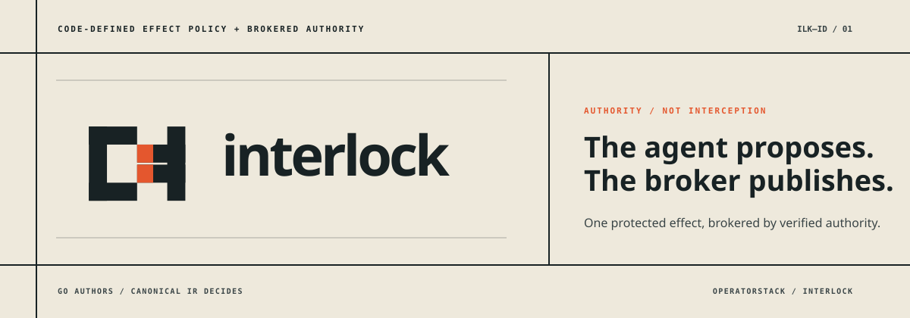
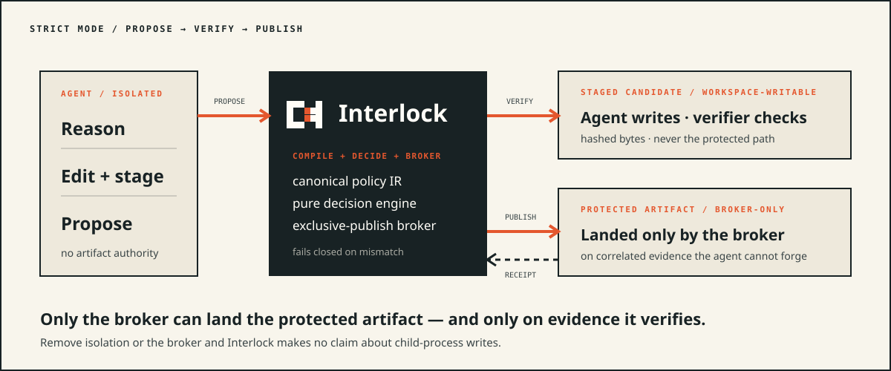
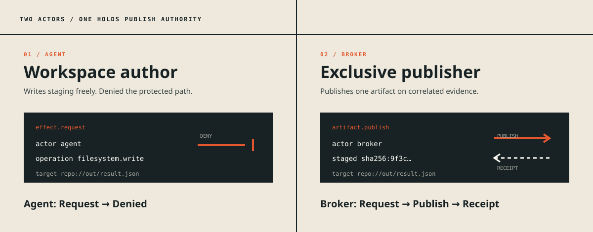

<p align="center">
  
</p>

<p align="center">
  <strong>Give one protected effect to code the agent cannot influence.</strong>
</p>

<p align="center">
  Code-defined effect policy and brokered authority for coding-agent tooling.
</p>

A coding agent runs shell commands, spawns child processes, and edits files. You
cannot reliably observe every filesystem write a `python generate.py` performs —
the command string tells you nothing about what the process does. Interlock takes
the honest position: the guarantee you can keep is **who holds the authority to
perform an effect**, not **whether you can see every attempt to perform it.**

Interlock lets a separately compiled policy grant *exclusive authority over one
protected effect* — "publish this staged file to this final path" — to a verified
broker. The agent stays free to reason and to modify its own workspace; the one
effect that matters is landed only by code the agent cannot influence at decision
time.

Interlock decides. The broker performs. The agent never holds the authority.

## See it work

The fastest way to understand Interlock is to watch an agent's publish get denied
and a verified publisher's succeed. Every command below is exactly what
[`scripts/validate.sh`](https://github.com/operatorstack/intelligence-flow/blob/main/labs/21-interlock/scripts/validate.sh) exercises on a clean build, so the
behavior is verified, not aspirational.

**1. Compile a code-defined policy to canonical IR.** A policy is a tiny Go
module that emits its IR on stdout; `compile` builds and runs it:

```bash
interlock compile ./examples/exclusive-publish -o policy.json
interlock check policy.json      # validates the IR and prints its SHA-256 hash
```

The `exclusive-publish` policy says three things: the agent may work freely in
`repo://work/**`, the agent may **not** write or publish `repo://out/result.json`,
and a verified publisher may publish it — but only with a matching policy hash, a
staged-candidate hash, and a released DeltaWire supervision receipt.

**2. The agent's own publish is denied.** No rule grants the agent publish
authority over the artifact, and an explicit deny rule covers it:

```bash
echo '{"protocol":"interlock.effect.v1","request_id":"cli-1","run_id":"cli-run","actor":"agent","operation":"artifact.publish","resource":{"kind":"file","uri":"repo://out/result.json"}}' > deny-req.json
interlock decide policy.json deny-req.json
```

```json
{
  "protocol": "interlock.decision.v1",
  "request_id": "cli-1",
  "policy_hash": "sha256:…",
  "outcome": "deny",
  "rule_id": "deny-agent-artifact",
  "reason": "the producing agent may not touch the protected artifact"
}
```

**3. The broker publishes — on truthful, durable evidence.** The broker hashes the
real staged bytes, re-reads the upstream evidence envelope from disk, and
atomically promotes the file to the protected path:

```bash
interlock publish policy.json pub.json
# → repo://out/result.json now holds the byte-exact staged candidate
```

Upstream evidence is a durable envelope (`{schema, run_id, status,
artifact_sha256}`) the broker re-reads — it takes the receipt schema and status
*from the file*, never from a caller-claimed struct field, and requires the
envelope's `artifact_sha256` to match the exact staged bytes it just hashed. This
is **hash-binding, not authenticity**: it proves the evidence refers to *these
bytes* for *this run* — defeating stale, copied, cross-run, or typo'd claims — but
does not by itself prove who produced them (whoever can write the staged file can
write the envelope). If the staged hash, policy hash, envelope status, run
correlation, hash-binding, or expected target state is wrong, the publish **fails
closed** and the target is left untouched. The engine compares *claims*; the
broker is what makes claims *truthful*.

**4. Every decision is a receipt you can replay.** `simulate` turns a request
stream into a hash-linked receipt chain; `replay` re-derives each decision and
verifies the chain end to end:

```bash
interlock simulate policy.json reqs.jsonl <run_id> -o receipts.jsonl
interlock replay   policy.json reqs.jsonl receipts.jsonl
```

Replay fails closed on a changed policy, a missing or reordered link, mismatched
evidence, a duplicate or out-of-order sequence, a cross-run receipt, or any
committed field edited after the fact.

## Does it work?

Every claim below is checked by `interlock verify`, which runs the release proof
against the shipped runtime — the real engine, broker, and receipt chain, not a
prose description of them. This section is **generated** by
`scripts/gen-proof.sh` and **diff-gated in CI**: a hand-edited table fails the
build, so a green row can never drift into marketing fiction. Run it yourself:

```bash
interlock verify              # PASS/FAIL per guarantee, RESULT, commit, protocol
interlock verify --format json
```

<!-- interlock-proof:start -->
| Claim | Result | Evidence |
| --- | --- | --- |
| Canonical IR is deterministic | PASS | 4 frozen policy hashes |
| Engine decisions conform | PASS | positive + negative vectors |
| Broker publishes exact bytes | PASS | broker lifecycle suite |
| Evidence mismatch fails closed | PASS | negative broker vectors |
| Receipt chains detect mutation | PASS | replay suite |
| Pitot transports decisions | PASS | Controller round-trip |

Verified at commit `07dad7e`.
<!-- interlock-proof:end -->

The `interlock verify` binary carries these checks with no toolchain required. A
compatibility-lock corpus (`conformance/compat/v0.1.0/`) freezes today's policy
hashes and decisions: future releases may add vocabulary, but a changed old hash
or old decision is a breaking change and fails CI.

## Why Interlock, and not Pitot?

[Pitot](https://github.com/operatorstack/pitot) is deliberately generic transport: it has no file-write
action kind, and its hook event carries only a bare command string. Teaching
Pitot to gate file writes by parsing shell text would be **dishonest** — it cannot
see child-process writes — and would pollute a transport layer with a much larger
policy concern. The responsibility split stays clean:

| Component | Owns |
|---|---|
| **Interlock** | code-defined policy + brokered protected effects |
| **Pitot** | transport of observable actions/decisions (policy-neutral) |
| **DeltaWire** | producing and independently verifying one candidate artifact |

<p align="center">
  
</p>

## Two actors, one authority

<p align="center">
  
</p>

| Actor | May do | May **not** do |
|---|---|---|
| **Agent** | reason, edit, write staging, *propose* a publish | write or publish the protected artifact |
| **Broker** | publish the artifact on correlated evidence | anything the compiled policy does not allow |

The separation is structural, not advisory: in strict mode the agent has no write
authority over the protected path, so a denied agent cannot fall back to touching
the file itself.

## Policy as code: Go authors, canonical IR decides

> **Go is the authoring language. Canonical IR is the execution language.**

Arbitrary Go may **construct** a policy — loops, helpers, tables, whole packages.
Only **framework predicates** may **decide** a request. There are no arbitrary Go
callbacks at decision time, because a callback would reintroduce hidden I/O,
nondeterminism, and replay failure into the one component that must stay pure.

```go
il.Policy("exclusive-publish.v1").
    Actor("agent").
    Actor("publisher").
    File("artifact", "repo://out/result.json").
    Tree("workspace", "repo://work/**").
    Allow("agent-workspace").By("agent").To(il.Write, il.Delete).On("workspace").
        Because("the agent may work freely in its own workspace").Add().
    Deny("deny-agent-artifact").By("agent").To(il.Write, il.Publish).On("artifact").
        Because("the producing agent may not touch the protected artifact").Add().
    Allow("allow-publisher").By("publisher").To(il.Publish).On("artifact").
        Requiring(
            il.PolicyHashMatch(),
            il.StagedHashMatch(),
            il.ReceiptStatus("deltawire.supervision.receipt.v1", "released"),
        ).
        Because("the verified publisher may publish a staged candidate").Add()
```

`interlock compile` builds and runs the module's entrypoint, which prints
`Build().Emit()` — the canonical IR. Equivalent source produces identical IR and
therefore an identical policy hash (proved by
[`check-determinism.sh`](https://github.com/operatorstack/intelligence-flow/blob/main/labs/21-interlock/scripts/check-determinism.sh)). The compiler rejects
structurally invalid policies **before any request is evaluated**: duplicate ids,
unknown actors/resources/operations, conflicting allow/deny on the same matcher,
unreachable (shadowed) rules, and requirements on deny rules.

Arbitrary construction, canonical result — a helper can loop over generated-output
globs and emit one deny + one evidence-gated allow per tree
([`examples/generated-file-protection`](examples/generated-file-protection));
the Go is gone by decision time, leaving a plain, hashable decision table.

## Effect model (fixed V1 vocabulary)

Deliberately small — it can grow later without an IR redesign.

| Operations | Resource kinds | Outcomes |
|---|---|---|
| `filesystem.read` · `write` · `delete` | `file` — exact URI | `allow` |
| `filesystem.rename_from` · `rename_to` | `tree` — prefix/glob (`repo://…/**`) | `deny` (default) |
| `process.execute` · `artifact.publish` | `process` — executable class | `require` · `fault` |

Allow rules may carry evidence predicates: `policy_hash_match`,
`staged_hash_match`, `target_hash_match`, and `receipt_status`. **Excluded from
V1:** databases, HTTP, Git, browsers, payments, secrets, deployments, messaging,
and any custom decision-time predicate.

## The enforcement boundary (what is and isn't guaranteed)

Interlock is explicit about its coverage. There are three modes; only one is the
V1 guarantee.

- **Observed** — a host-visible, truthful file action is intercepted before
  execution and routed for an allow/deny. Enforceable only where a native action
  faithfully describes the effect. Pitot emits no file-write action kind today, so
  this is a later "if available" fixture, not the guarantee.
- **Opaque process** — `python generate.py` is observable only as
  `process.execute`. Interlock **must not** infer filesystem effects from the
  command string. It records the process event and nothing more.
- **Strict (the V1 guarantee)** — the agent runs in an isolated workspace with no
  write authority over the protected artifact:

  ```
  agent → staged candidate (workspace-writable)
        → DeltaWire verifies the candidate
        → Interlock validates receipts + policy hash
        → BROKER atomically publishes to the protected path
  ```

The guarantee is not "Interlock sees every write." It is: **the agent cannot
modify the protected artifact, and only the broker can — and only for a request
the compiled policy allows on truthful evidence.** Remove isolation or the broker,
and Interlock makes no claim about child-process writes. This honesty is enforced
by the broker tests, not just asserted here.

## Install

```bash
go install github.com/operatorstack/interlock/cmd/interlock@latest
```

Or build from a checkout and inspect environment readiness:

```bash
go build -o interlock ./cmd/interlock
interlock doctor
```

```
interlock doctor
  policy protocol : interlock.policy.v1
  effect protocol : interlock.effect.v1
  receipt schema  : interlock.receipt.v1
  go toolchain    : available
```

`interlock init <dir>` scaffolds a minimal, runnable policy module to start from.

## Validation

`scripts/validate.sh` is the single entrypoint. It runs `gofmt`, `go vet`, the
test suites (repeated, and under `-race`), the purity boundary check, IR
determinism, embed-FS conformance, a static `CGO_ENABLED=0` build, and a full CLI
lifecycle (`init → compile → check → explain → decide → publish → simulate →
replay`) — including a negative case proving replay rejects a mismatched policy.

```bash
bash scripts/validate.sh
```

## Project layout

```text
interlock/
├── spec/        typed constructors → validated in-memory policy
├── compiler/    spec → canonical IR, with structural diagnostics
├── ir/          canonical Effect Policy IR: stable bytes + stable SHA-256
├── engine/      pure Decide(policy, request) → decision (no I/O, deterministic)
├── protocol/    effect-request / decision wire types
├── receipt/     hash-linked decision receipts + replay verification
├── broker/      exclusive-publish: verify → stage → atomic promote → receipt
├── workspace/   isolation helpers for the strict-mode experiment
├── conformance/ embedded positive/negative fixtures + Go tests
├── examples/    exclusive-publish · generated-file-protection
└── cmd/interlock/  the reference Go executable
```

## Design principles

1. **Authority, not interception.** Guarantee who may perform an effect, not that
   every attempt is observed.
2. **Go authors; IR decides.** Arbitrary construction, framework-only decisions —
   deterministic, hashable, replayable.
3. **Fail closed.** Any mismatch in policy, evidence, hash, or correlation denies
   the effect and leaves the target untouched.
4. **The engine trusts claims; the broker makes them truthful.** Purity lives in
   the engine; real hashing and receipt correlation live in the broker.
5. **Be honest about coverage.** Never claim a guarantee the architecture cannot
   keep — command strings do not secure opaque process effects.

## What Interlock does not decide

Interlock does not define whether work is correct, whether an artifact is safe to
ship, or what "released" means. It enforces that *if* your compiled policy says a
publish is allowed on given evidence, then **only** the broker performs it, and
**only** when that evidence is truthful. Producing and verifying the candidate is
DeltaWire's job; transporting observable actions is Pitot's.

**The agent proposes. The broker publishes.**

## Status

This is a research lab. **M1 (the standalone core)** is complete: spec + compiler
+ canonical IR/hash, a pure decision engine, hash-linked receipts + replay, and
the exclusive-publish broker with an isolation fixture — all green under
`scripts/validate.sh` with zero external dependencies. **M2** is complete:
DeltaWire delegates its one protected effect — the final atomic promote — to this
broker, importing Interlock as a library only (never into its compiler or
evaluator); `deltawire supervise --broker` runs the whole stack through
`broker.Publish`. The broker re-reads a durable, hash-bound upstream evidence
envelope written before the promote — taking status from the file, never a
caller-claimed string — and gates on DeltaWire's honest pre-promote status
(`release_authorized`), since the run is released only *because* the broker
publishes. **M3** is complete: a second, non-DeltaWire tenant (the
[`release-manifest`](interlock/examples/release-manifest) example — different
artifact, actors, and receipt schema) flows through the *same* `broker.Publish`
and the same conformance suite, proving the core carries no DeltaWire-specific
branches. The **Pitot decision-transport leg** is implemented as an ordinary
Pitot subprocess Controller in a separate integration module
([`integrations/pitot`](integrations/pitot)): Pitot launches the controller and
streams `control.requested` events to it, and the controller runs the pure
`engine.Decide` and answers allow/deny — with **no Pitot source change** and
without the interlock core ever importing Pitot. This transports/observes
decisions and is **not** the enforcement guarantee (the broker remains that), so
it is off the critical path. With M1–M3 green, extracting a public
`operatorstack/interlock` is now a reasonable next step.

## License

Apache-2.0
